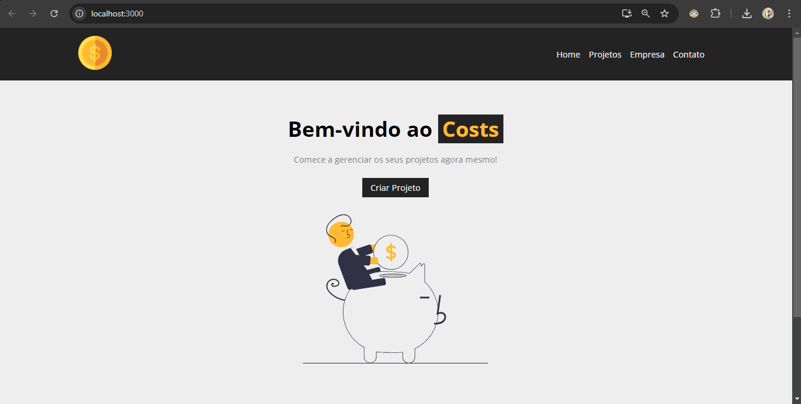

      

# Costs_In_React

## Sistema de Controle de Gastos

### Descrição

<p>
    Projeto desenvolvido como parte de estudos complementares para construção sólida no conhecimento do front-end, com o objetivo de criar uma aplicação fullstack utilizando React JS. A aplicação permite o cadastro de projetos com informações sobre custos iniciais, armazenando esses dados em um banco de dados.
</p>

### Funcionalidades

* <strong>Cadastro de Projetos</strong>: Usuários podem adicionar novos projetos através de um formulário.
* <strong>Visualização de Projetos</strong>: Exibe a lista de projetos cadastrados.
* <strong>Banco de Dados</strong>: Armazena as informações dos projetos e seus custos iniciais.

### Tecnologias utilizadas

* <strong>Javascript</stron>
* <strong>React JS</strong>
* Para o banco de dados foi utilizado o <strong>JSON</strong> do js

### Instalação

* Utilização do gerenciamento de projetos do react js: 
```bash
npx create-react-app
```

* Para quando ocorrer algum erro de depenência no nodejs do sistema operacional:
```bash
npm install
```

* Execução do projeto: 
```bash
npm start
```

* Para a execução do backend, execução do banco de dados: 
```bash
npm run backend
````

### Estrutura do projeto
* **Front-end**: HTML5, CSS3.
* **Back-end**: javascript, React JS.

### Imagem gif

  
